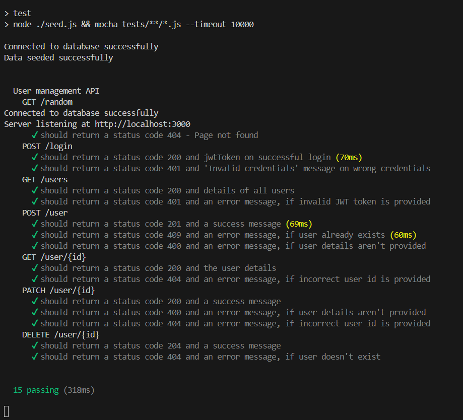
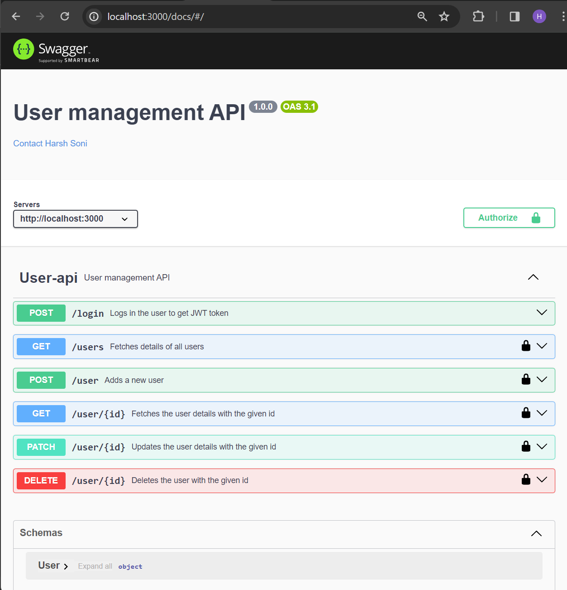
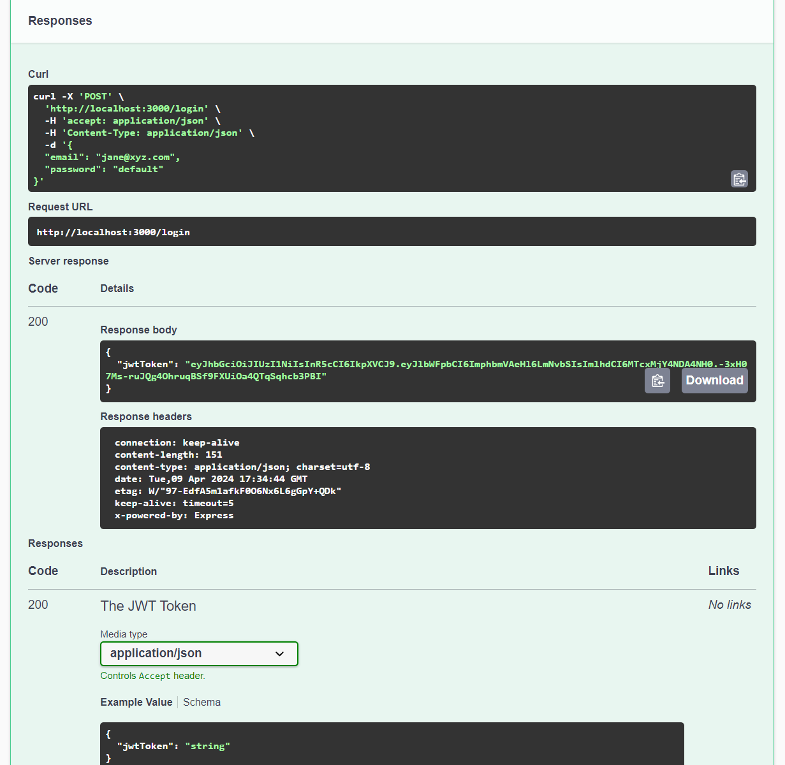

# User Management API

This API provides functionality for managing users, including registration, authentication, profile management, and more.

## Table of Contents

- [Introduction](#introduction)
- [Features](#features)
- [Technologies Used](#technologies-used)
- [Getting Started](#getting-started)
  - [Installation](#installation)
  - [Setting Up Environment Variables](#setting-up-environment-variables)
  - [Starting the Server](#starting-the-server)
- [API Documentation](#api-documentation)
- [Testing](#testing)
- [Contributing](#contributing)
- [License](#license)

## Introduction

This project aims to assess someone's basic backend development skills by implementing a User Management API using Node.js and MongoDB. The API includes endpoints for user registration, authentication, profile management, and more.

## Features

- User registration with validation
- User authentication using JWT tokens
- User profile management
- User role management
- Secure password hashing
- API documentation using Swagger
- Unit testing using Chai and Mocha

## Technologies Used

- Node.js
- MongoDB
- Express.js
- Swagger (for documentation)
- Chai & Mocha (for testing)

## Getting Started

### Installation

1. Clone the repository:

   ```
   git clone https://github.com/harshsoni-harsh/user-management-backend
   ```

2. Install dependencies:

   ```
   npm install
   ```

### Setting Up Environment Variables

Create a `.env.local` file in the root directory of the project and add the following environment variables:

```
MONGODB_URI=<your-mongodb-uri>
JWT_SECRET=<your-jwt-secret>
```

### Starting the Server

Start the server:

```
npm start
```

The API will be available at `http://localhost:3000`.

## API Documentation

The API endpoints are documented using Swagger. To view the documentation, open your web browser and navigate to `http://localhost:3000/docs`.

### Example Screenshots

- **npm run test**

  

- **GET /docs**

  

- **POST /login**

  

## Testing

To run the tests:

```
npm run test
```